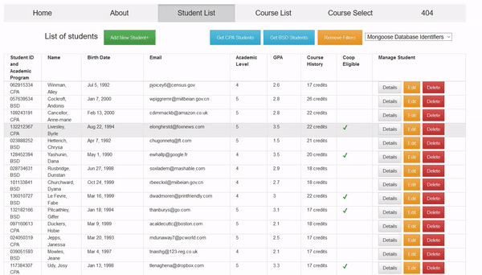

# Student Enrolment App

## Overview

An Angular application designed to render student information
fetched from a web service and allow students to perform CRUD
operations on their school account. The application makes use of
two-way data binding to render a visual schedule builder for
students to easily enrol in courses and see course conflicts as
they build their timetable.

Visit the site [here.](https://quiet-cliffs-46230.herokuapp.com/home "Student Enrolment App Homepage")

## Demonstration GIFs

